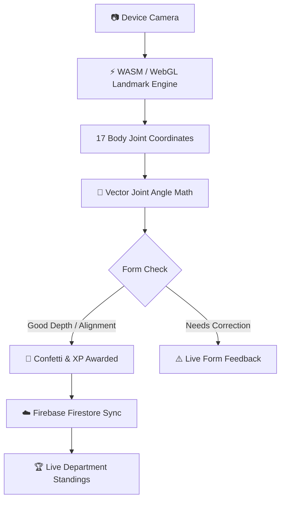

# 🔥 AuraFit — Gamified Campus Fitness & AI Posture Corrector

> **Smart India Hackathon 2026 Submission** | **Problem ID:** SIH26196  
> **Theme:** Fitness & Sports (Student Innovation Track)  
> *Built with React 19, Vite, Firebase, and lots of late-night chai ☕ by a team of 6 college students.*

[](https://sih.gov.in)
[](https://react.dev)
[](https://sih.gov.in)

---

## 👋 Hey there! Welcome to AuraFit

Staying active in college is hard. Between morning lectures, coding assignments, and hostel life, finding motivation to exercise alone in a hostel room usually fizzles out after three days. Most fitness apps either require expensive fitness bands or charge expensive monthly subscriptions.

We built **AuraFit** to fix this! It is a free, lightweight web app that turns fitness on campus into a fun, social experience:

1. 🏋️ **AI Posture Arena:** Use your laptop or phone camera to track your exercise form in real-time (**Squats**, **Push-ups**, and **Plank**). No videos are ever sent to a server — everything runs 100% privately in your browser!
2. 🏆 **Department Wars:** Every completed rep earns Aura XP for your branch (CSE vs ECE vs MECH vs EEE). Compete to see which department takes #1 on campus!
3. 🤝 **Campus Buddy Finder:** Filter students by branch, hostel, sports (running, gym, yoga, badminton), and workout times to find an accountability partner.
4. 📊 **Daily Student Dashboard:** Keep track of your daily water intake, step goals, sleep hours, and recent workouts.

---

## ✨ Features at a Glance

| Feature | What it does |
| :--- | :--- |
| **🤖 Real-Time AI Form Check** | Tracks 17 body keypoints with camera HUD overlays and angle calculation. Gives instant feedback if your squat is deep enough or your spine is straight during planks. |
| **⚡ 1-Click Jury Demo Mode** | Test the full experience instantly as CSE or ECE without typing in credentials. |
| **⚔️ Department Wars Leaderboard** | Live real-time scoreboards syncing branch XP and celebrating campus top athletes. |
| **👥 Buddy Matcher** | Multi-filter search across departments, hostels, sports, and timings with instant invite cards. |
| **💧 Hydration & Activity Tracker** | Interactive water logger (`+250ml`), step counter, and manual workout logger saved to local storage and Firestore. |
| **🔔 Glassmorphism Toast UI** | Smooth, non-blocking toast notifications for workout saves and invitations. |

---

## 🛠️ How It Works Under the Hood

### System Workflow



### 📐 The Math Behind Joint Tracking
To calculate joint flexion (such as the knee angle during squats, elbow angle during push-ups, or spine alignment in planks), we compute the angle $\theta$ between vectors formed by the joint coordinates:

$$\vec{u} = \text{Joint}_1 - \text{Joint}_2 \quad\text{and}\quad \vec{v} = \text{Joint}_3 - \text{Joint}_2$$

$$\theta = \arccos\left(\text{clamp}\left(\frac{\vec{u} \cdot \vec{v}}{\|\vec{u}\| \|\vec{v}\|}, -1.0, 1.0\right)\right) \times \frac{180^\circ}{\pi}$$

- **Squats:** Detects depth when knee angle drops below $90^\circ$ and counts a rep when you stand back up ($> 160^\circ$).
- **Push-ups:** Tracks chest drop ($< 90^\circ$) and full lockout ($> 160^\circ$).
- **Plank:** Measures neutral spine alignment ($165^\circ - 180^\circ$) and awards XP for continuous 5-second isometric holds.

---

## 💻 Tech Stack We Used

- **Frontend:** React 19, JavaScript (ES6+), Vanilla CSS with custom glassmorphism design tokens
- **Build Tool:** Vite 7 (super-fast hot module reloading & lightweight bundles)
- **Backend & Database:** Firebase Auth, Cloud Firestore (Real-time `onSnapshot` listeners)
- **Icons & Effects:** Lucide React, Canvas-Confetti
- **Privacy:** 100% client-side video processing — zero frames saved or uploaded

---

## 🚀 Running the Project Locally

Want to test AuraFit on your machine? Here's how to get it running in 2 minutes:

### 1. Clone the repository
```bash
git clone https://github.com/Sai-1234-kinetic-coder/aurafit-2026.git
cd aurafit-2026
```

### 2. Install dependencies
```bash
npm install
```

### 3. Set up environment variables
Copy the example environment file:
```bash
cp .env.example .env
```
*(Optional) Add your Firebase project credentials to `.env`. Even without Firebase keys, the app includes full offline and demo simulation modes!*

### 4. Start the development server
```bash
npm run dev
```
Open your browser at `http://localhost:3000` to start exploring!

---

## 📱 Tested on Real Student Devices

We tested AuraFit across multiple screen sizes to make sure it runs smoothly for every student:
- 💻 **Laptops & Desktops** (Chrome, Firefox, Edge, Brave)
- 📱 **Budget Android Phones** (Smooth responsive layout, single-column mode)
- 📟 **College Tablets** (Samsung Galaxy Tab A7 tested with dynamic canvas dimension auto-alignment)

---

## 👥 The Team

We are a group of college students passionate about software, sports, and AI:

- 👨‍💻 **Lalam Chandramouli** — *Team Lead & Architecture*
- 🧠 **Lalam Sai Bharadwaj** — *Pose Estimation & Joint Math*
- ☁️ **Kandregula Veda Laxmi** — *Backend & Database Sync*
- 🎨 **Lalam Kalpana** — *UI/UX Design System & Leaderboards*
- 🤝 **Kasireddi Spandana** — *Buddy Finder & Community Features*
- 🔍 **Kovvuri Naveena** — *Device Testing & QA*

---

## 🌟 Acknowledgements

Huge thanks to **AICTE** and the **Smart India Hackathon 2026** team for the opportunity to build and showcase this project!

*If you like this project, feel free to give it a ⭐ on GitHub!*
