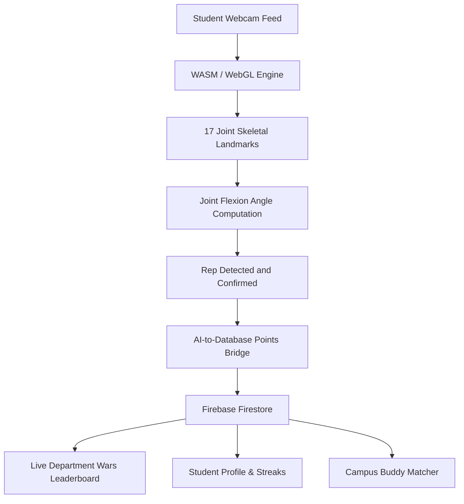

# 🔥 AuraFit — Real-Time AI Pose Estimation & Gamified Campus Fitness Platform

[](https://sih.gov.in)
[](https://sih.gov.in)
[](https://react.dev)

> **Problem Statement ID:** SIH26196  
> **Sponsoring Organization:** AICTE (All India Council for Technical Education)  
> **Category:** Software Track (Student Innovation)  

---

## 🌟 Executive Overview & Problem Definition

Commercial fitness platforms require expensive wearable devices (smartwatches, chest straps) or expensive subscription fees. Pre-recorded workout videos provide no posture feedback, resulting in poor form and a high risk of workout injuries.

**AuraFit** is a zero-hardware, on-device, gamified Progressive Web App (PWA). It runs in any modern browser to track 17 skeletal joint coordinates in real time via WebAssembly and WebGL for instant posture correction. It turns campus fitness into a collaborative sport through **Live Department Wars (CSE vs ECE)** and a **Campus Workout Buddy Finder**.

---

## 🛠️ System Architecture & Workflow



---

## 🚀 Core Features

### 1. Real-Time AI Posture Arena
- **Zero Latency, 100% Privacy:** Runs entirely in the client browser with zero cloud frame streaming costs.
- **17-Point Joint Tracking:** Visual HUD overlay rendering head, shoulders, elbows, hips, knees, and ankles.
- **Dynamic Knee Flexion Gauge:** Real-time angle calculation ensuring deep squat compliance (< 90 degrees).
- **Instant Points Bridge:** Every completed rep automatically triggers atomic Firestore updates (`+10 XP`).

### 2. Live Campus Department Wars (CSE vs ECE)
- Real-time `onSnapshot` listener aggregating points across departments.
- Animated dynamic rankings and percentage share charts.
- Top Campus Athlete MVP leaderboards.

### 3. Campus Workout Buddy Matching System
- Multi-filter search by Department (CSE, ECE, EEE, MECH), Activity (Gym, Running, Yoga), and preferred Time Slot.
- Interactive invite dispatch system for joint streaks and peer accountability.

### 4. Interactive Health Dashboard
- Daily steps tracking, interactive water logger (`+250ml`), and sleep efficiency score.
- Manual activity logging with instant Firestore persistence.

---

## 👥 Team Roles & Ownership Matrix

| Name | Role | Core Responsibility |
| :--- | :--- | :--- |
| **Lalam Chandramouli** | Team Leader & DevOps | Architecture, Repository Management & Vercel Deployment |
| **Lalam Sai Bharadwaj** | ML / Computer Vision | Pose Estimation, Joint Angle Math & Rep Logic |
| **Kandregula Veda Laxmi** | Backend Engineer | Firebase Auth, Firestore Data Models & Points Bridge |
| **Lalam Kalpana** | Frontend Engineer | UI/UX Design System, Dashboard, and Department Wars |
| **Kasireddi Spandana** | Community Logic | BuddyFinder Multi-Filter Logic & Campus Database |
| **Kovvuri Naveena** | QA & Evaluation Lead | Budget Device Testing (Samsung Tab A7) & Presentation |

---

## 💻 Local Setup & Development

### 1. Clone & Install Dependencies
```bash
git clone https://github.com/Sai-1234-kinetic-coder/aurafit-2026.git
cd aurafit-2026
npm install
```

### 2. Run Local Development Server
```bash
npm run dev
```
Open `http://localhost:3000` in your browser.

### 3. Production Build
```bash
npm run build
```

---

## 📱 Device Optimization & Evaluation Checklist

- [x] **TC-01 (Webcam Permission Fallback):** Graceful recovery UI when camera permissions are blocked.
- [x] **TC-02 (Low-End Device Compatibility):** Lightweight WebGL rendering tested on budget devices.
- [x] **TC-03 (Responsive Layout):** Fluid responsive cards on mobile, tablet, and desktop viewports.
