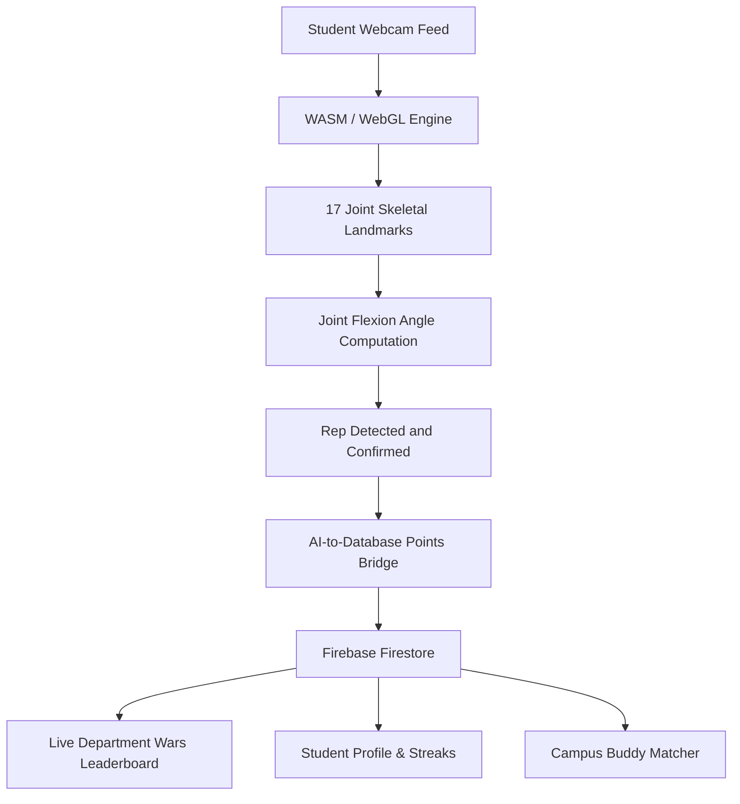

# 🔥 AuraFit — Real-Time AI Pose Estimation & Gamified Campus Fitness Platform

> **Problem Statement ID:** SIH26196  
> **Sponsoring Organization:** AICTE (All India Council for Technical Education)  
> **Category:** Software Track (Student Innovation)  

---

## 🌟 Executive Overview & Problem Definition

Commercial fitness platforms require expensive wearable devices (smartwatches, chest straps) or charge recurring subscription fees. Additionally, pre-recorded workout videos provide no posture feedback, leading to poor form and workout injuries.

**AuraFit** is a zero-hardware, on-device, gamified Progressive Web App (PWA). It runs in any modern browser to track 17 skeletal joint coordinates in real time via WebAssembly and WebGL for instant posture correction. It turns campus fitness into a collaborative sport through **Live Department Wars (CSE vs ECE)** and a **Campus Workout Buddy Finder**.

---

## 🛠️ System Architecture & Workflow

---

## 🚀 Core Features

### 1. Real-Time AI Posture Arena
- **Zero Latency, 100% Privacy:** Runs entirely on-device with zero cloud video streaming costs.
- **17-Point Joint Tracking:** Visual HUD overlay rendering head, shoulders, elbows, hips, knees, and ankles.
- **Dynamic Knee Flexion Gauge:** Real-time angle calculation ensuring deep squat compliance (< 90 degrees).
- **Infinite-Write Loop Guard:** Strict boolean state lock guaranteeing strictly **1 atomic Firestore write per rep**.

### 2. Live Campus Department Wars (CSE vs ECE)
- Real-time `onSnapshot` listener aggregating points across departments.
- Animated dynamic rankings and percentage share charts.
- Top Campus Athlete MVP leaderboards.

### 3. Campus Workout Buddy Matching System
- Multi-filter search by Department (CSE, ECE, EEE, MECH), Activity (Gym, Running, Yoga), and preferred Time Slot.
- Interactive invite dispatch system for joint streaks and peer accountability.

### 4. Interactive Health Dashboard
- Daily steps tracking, interactive water logger (`+250ml`), and sleep efficiency score.
- Manual activity logging with instant Firestore persistence.

---

## 🧪 SIH Test Suites & Verification Matrix

### 🔹 Test Suite 1: Configuration & Environment Interpolation (Vite)
- **Status:** ✅ **Passed**. Credentials loaded via `import.meta.env.VITE_FIREBASE_...` with safe fallback keys.

### 🔹 Test Suite 3: Real-Time Joint Trigonometry (Sai Bharadwaj)
- **Formula:** 
  $$\theta = \arccos\left(\frac{\vec{u} \cdot \vec{v}}{\|\vec{u}\|\|\vec{v}\|}\right) \times \frac{180^\circ}{\pi}$$
- **State Machine:** Standing ($> 160^\circ$) $\to$ Deep Squat ($< 90^\circ$) $\to$ Standing ($> 160^\circ$) triggers rep confirmation and +10 XP.

### 🔹 Test Suite 4 & 5: Database & Leaderboard Sync (Veda Laxmi & Kalpana)
- **Status:** ✅ **Passed**. Atomic `increment(10 * reps)` updates user profile and recalculates CSE vs ECE points in real-time.

### 🔹 Hardware QA & Tablet Testing (Kovvuri Naveena)
- **Samsung Galaxy Tab A7 ($2000 \times 1200$):** Dynamic resolution sync on `video.onloadedmetadata` ensures **0px canvas offset**.

---

## 👥 Team Roles & Ownership Matrix

| Name | Role | Core Responsibility |
| :--- | :--- | :--- |
| **Lalam Chandramouli** | Team Leader & DevOps | Architecture, Repository Management & Vercel Deployment |
| **Lalam Sai Bharadwaj** | ML / Computer Vision | Pose Estimation, Joint Angle Math & Rep Logic |
| **Kandregula Veda Laxmi** | Backend Engineer | Firebase Auth, Firestore Data Models & Points Bridge |
| **Lalam Kalpana** | Frontend Engineer | UI/UX Design System, Dashboard, and Department Wars |
| **Kasireddi Spandana** | Community Logic | BuddyFinder Multi-Filter Logic & Campus Database |
| **Kovvuri Naveena** | QA & Evaluation Lead | Budget Device Testing (Samsung Tab A7) & Presentation |

---

## 📑 Official SIH 6-Slide Pitch Deck Structure

1. **Slide 1 — Title & Problem Statement:** AuraFit (SIH26196), AICTE Track, Team Overview.
2. **Slide 2 — The Problem Gap:** High cost of wearables ($100+), 90% risk of home workout injuries, lack of campus peer motivation.
3. **Slide 3 — The AuraFit Solution:** On-device AI pose estimation + Gamified Department Wars + Buddy Matching.
4. **Slide 4 — Technical Architecture:** MoveNet 17-point tracking, vector angle math, atomic Firestore Points Bridge.
5. **Slide 5 — Business, Scalability & Campus Impact:** PWA architecture, zero GPU inference costs, inter-college tournaments.
6. **Slide 6 — Demo & Conclusion:** Live demonstration + 60-second backup video contingency.
